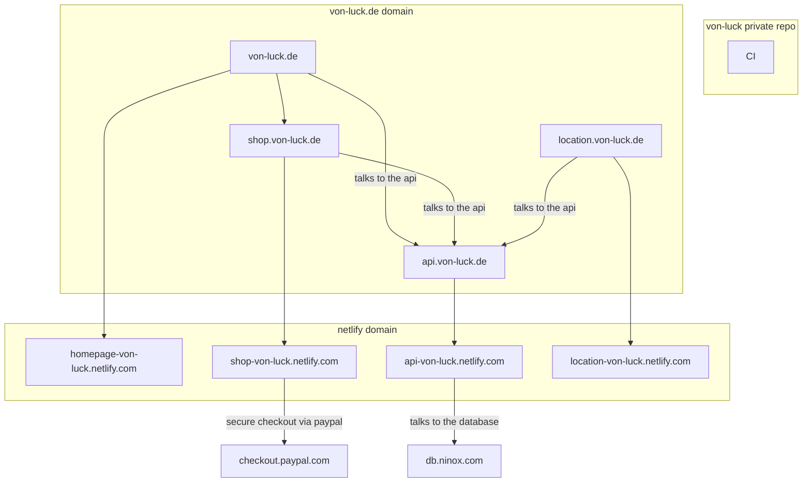

# von-luck (public)
_This is a public README for the private repo of all von-luck related code._
_We show the software system components and explain their role._
_This repo holds no code for the actial system._

## About the System Components

### The Homepage

The homepage is the cusmoters entrypoint. It is a html page served by a simple web server. The information on the homepage is mostly staitc exept for the location specific information, which is fetched via the api from the database.

### The Onlineshop

The online shop is where the customers have the chance to preorder for later pickup at their nearest locations. The shop is a single page application, which is fetching the latest product information from the central database. The checkout is done via paypals managed secure checkout.

### The Location-App

The location app is for staff only. Only staff can login to the app at one of the von-luck locations. The orders from customers are fetched via the api from the central database and can be managed via the app.

## Component Communication, CI and CD

The dns records at von-luck.de forward the trafic to the managed deployments at netlify. The homepage, shop and the location app communicate with the api which is communicating with the managed database service at ninox.com. Every change to the system has to pass a continous integration pipeline before it gets merged into the private master branch. Each new push to master triggers the continous deployment pipeline on netlify. After manual inspection of the newest deployment the deployment is pulished and the dns record get adjusted by netlify to point to the new deployment. Netlify allows to rollback to every old deployment if needed. The components are written to allow for individual deployments of each component. The system works with component deployed from different commits.

